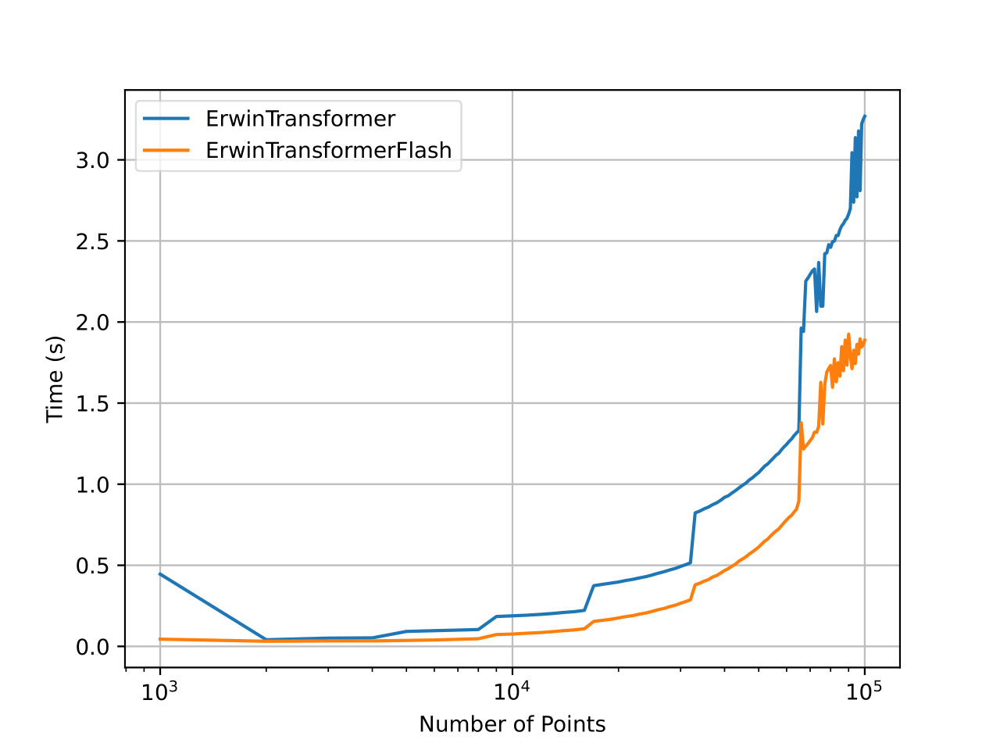

<div align="center">

<h3>ErwinFlashTransformer (Optimized Variant)</h3>

</div>

<div align="center">
    
    <p><em>Runtime Comparison: ErwinFlash vs Erwin. 1.9x average speed-up</em></p>
</div>

This model is an optimized version of the baseline `ErwinTransformer`.
The key differences and optimizations in `ErwinFlashTransformer` compared to `ErwinTransformer` lie primarily in its components:

*   **Attention Mechanism (`models/erwinflash/components/attention.py` vs `models/erwin/components/attention.py`):**
    *   `ErwinTransformer` uses a standard `BallMSA` (Ball Multi-Head Self-Attention) relying on `torch.nn.functional.scaled_dot_product_attention`.
    *   `ErwinFlashTransformer`'s `BallMSA` is significantly optimized by using `flash_attn_qkvpacked_func` from the `flash-attn` library. This provides substantial speed and memory improvements. It also uses mixed-precision (bf16) for linear layer computations within the attention module.
*   **Message Passing Neural Network (MPNN) (`models/erwinflash/components/mpnn.py` vs `models/erwin/components/mpnn.py`):**
    *   `ErwinTransformer` uses a standard MPNN implementation.
    *   `ErwinFlashTransformer` features an optimized MPNN:
        *   It fuses message and update functions into a single `fused_message_update` module list.
        *   It employs non-affine `LayerNorm` (`elementwise_affine=False`) for potential speed gains.
        *   It uses in-place addition for updates (`h.add_(update)`) to reduce memory overhead.

In summary, `ErwinFlashTransformer` is designed to be a more performant version of `ErwinTransformer` by incorporating advanced optimizations like FlashAttention and refined MPNN operations.

> [!WARNING]  
> It is recommended to use it along with mixed precision training, specially because of the use of `flash_attn_qkvpacked_func` which is optimized for bfloat16 precision:
> ```python
> from torch.amp import autocast
>
> model = ErwinFlashTransformer(...)
> with autocast('cuda', dtype=torch.bfloat16):
    >     output = model(input)
> ```